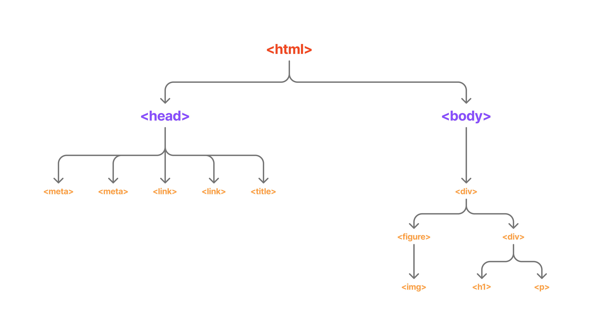
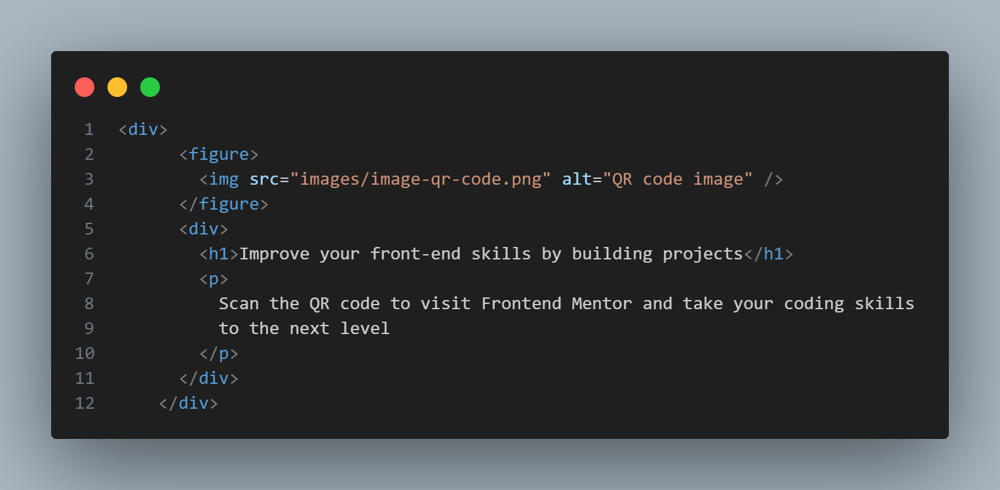
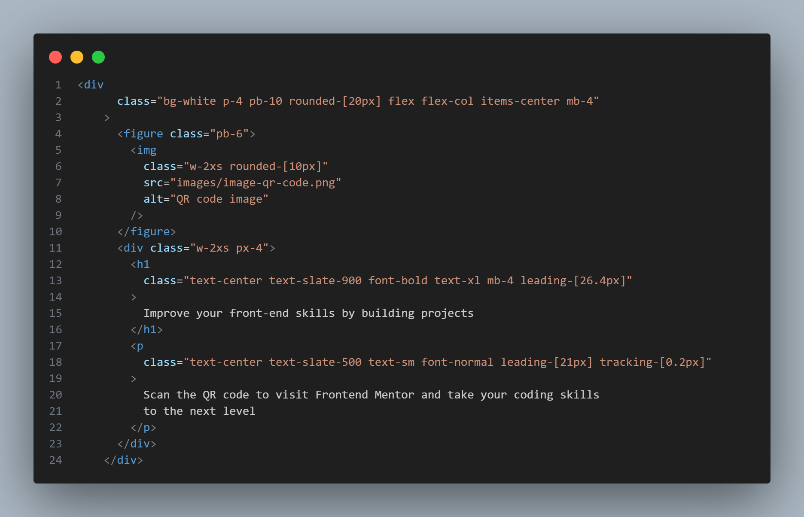

# Frontend Mentor - QR code component solution

This is a solution to the [QR code component challenge on Frontend Mentor](https://www.frontendmentor.io/challenges/qr-code-component-iux_sIO_H). Frontend Mentor challenges help you improve your coding skills by building realistic projects.

## Table of contents

- [Overview](#overview)
  - [Screenshot](#screenshot)
  - [Links](#links)
- [My process](#my-process)
  - [Built with](#built-with)
  - [Steps](#steps)
- [What I learned](#what-i-learned)
- [Author](#author)
- [Acknowledgments](#acknowledgments)

## Overview

This project is a QR code component built as part of a Frontend Mentor challenge. It showcases my ability to integrate Tailwind CSS version 4 with HTML to create responsive web components. This implementation highlights the utility-first approach of Tailwind CSS, enabling a simple, yet effective UI component design.

### Screenshot

### Links

- Solution URL: [Github](https://github.com/amine-can-code/frontend-mentor-challenges/tree/main/qr-code-component-main)
- Live Site URL: [Website](<[https://your-live-site-url.com](https://qr-code-component-challenge-01.netlify.app/)>)

## My process

### Built with

### Steps

1. **HTML DOM Tree Creation**: I started by sketching out the HTML DOM tree to plan the structure of the component. This step helped ensure that the HTML markup was organized and semantically correct.

2. **Coding the HTML**: Once the structure was planned, I coded the HTML part of the project.

3. **Installing Tailwind CSS**: After setting up the HTML, I installed Tailwind CSS in the project using CLI commands available in the [official Tailwind CSS documentation](https://tailwindcss.com/docs/installation/tailwind-cli). This setup involved initializing Tailwind's configuration to tailor the utility classes to the specific needs of this project.

4. **Styling with Tailwind CSS**: With Tailwind CSS installed, I styled the component to match the required design. This step involved applying utility classes to the HTML elements to achieve the desired aesthetics and responsiveness.

### What I learned

This project was not only about coding but also about learning to use GitHub more effectively. Committing my first project, though small, was a significant step for me in understanding version control and best practices in software development. Here are some key takeaways:

- **Version Control with GitHub**: I learned the importance of using `.gitignore` to exclude unnecessary files from my repositories. For instance, committing `node_modules` is not recommended because it can clutter the project repository with dependencies that can be easily installed via `npm`. This advice was reinforced by community feedback on my submission.

- **Community Engagement**: Participating in the Frontend Mentor community was incredibly educational. For example, I contributed by suggesting semantic improvements to another participant's project, advising them to wrap an `` tag inside a `<figure>` rather than a `` for better HTML semantics.

- **Peer Feedback**: Receiving feedback from others was equally valuable. I learned that excluding `node_modules` by adding it to `.gitignore` is a best practice that keeps the repository clean and manageable.

I highly recommend [Frontend Mentor](https://www.frontendmentor.io/) to anyone looking to improve their coding skills and understanding of best practices in a real-world project setting. Engaging with the community and exchanging feedback were crucial in deepening my understanding of both coding and version control systems.

## Author

- Website - [URL](https://portfolio-inprogress.netlify.app/)
- Frontend Mentor - [Profile](https://www.frontendmentor.io/profile/amine-can-code)

## Acknowledgments

I want to extend my sincere thanks to Frontend Mentor for providing such a well-structured and challenging platform that allows developers like myself to improve their coding skills through realistic projects. The detailed project briefs and community feedback system have been invaluable in my learning journey.

Additionally, I am deeply grateful to the Frontend Mentor community. The constructive feedback, suggestions, and encouragement from fellow developers have not only helped me refine my projects but also deepened my understanding of best practices in web development.

This experience has truly been enriching, and I look forward to participating in more challenges and continuing to learn and grow with this supportive community.
