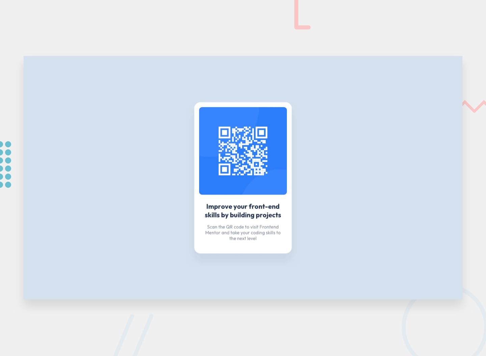

# QR Code Component - Frontend Mentor Challenge

This repository contains my solution to the QR code component challenge from Frontend Mentor, built with HTML and Tailwind CSS.

## Preview

## Technologies Used

## Features

This project includes a fully responsive QR code component that adapts to different device screen sizes.
